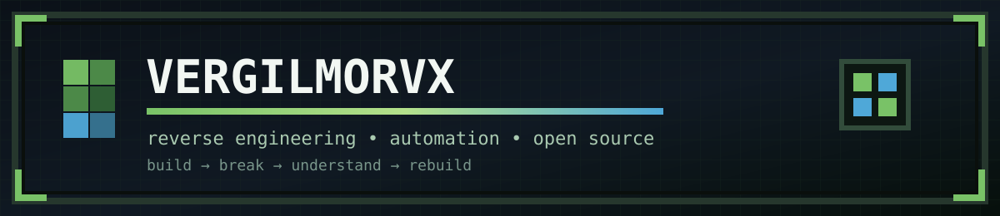
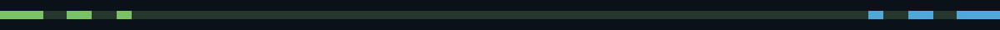
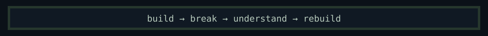

<div align="center">



<br/>

<a href="https://github.com/VergilMorvx">
  
</a>

<br/>


</div>

<br/>



## `> whoami`

```python
class Vergil:
    def __init__(self):
        self.focus = [
            "reverse engineering",
            "automation",
            "open-source tooling",
            "static recompilation",
            "modding & experimentation"
        ]

        self.languages = [
            "Python",
            "C++",
            "JavaScript"
        ]

        self.projects = [
            "MKVSDC: Resurrektion",
            "Steamer",
            "username-analysis-tool"
        ]

    def philosophy(self):
        return "If I want to understand it, I'll probably take it apart first."
```

<br/>


## `> stack`

<div align="center">

<table>
<tr>

<td align="center">

<br/>
<sub>C++</sub>
</td>

<td align="center">

<br/>
<sub>Python</sub>
</td>

<td align="center">

<br/>
<sub>CMake</sub>
</td>

<td align="center">

<br/>
<sub>Qt</sub>
</td>

<td align="center">

<br/>
<sub>SQLite</sub>
</td>

<td align="center">

<br/>
<sub>JavaScript</sub>
</td>

<td align="center">

<br/>
<sub>Git</sub>
</td>

<td align="center">

<br/>
<sub>GitHub</sub>
</td>

<td align="center">

<br/>
<sub>Windows</sub>
</td>

</tr>
</table>

</div>

<br/>


## `> featured_projects`

<table>
<tr>

<td width="33%" valign="top">

### `01 // MKVSDC: Resurrektion`

**Static recompilation of Mortal Kombat vs. DC Universe for modern 64-bit Windows.**

Translates the original Xbox 360 PowerPC executable into native C++ ahead-of-time and maps the Xenon platform's systems onto modern PC APIs including Direct3D 12, SDL3 audio, and a native virtual filesystem.

[**→ View repository**](https://github.com/VergilMorvx/MKVSDC-Resurrektion)

`C++` `Reverse Engineering` `PowerPC` `D3D12` `CMake`

</td>

<td width="33%" valign="top">

### `02 // Steamer`

An open-source Windows desktop tool for managing Steam `.lua` workflows, injecting configuration files, tracking ManifestIDs, and checking for updates through public SteamDB data.

Original idea & workflow by **VergilMorvx** · co-maintained with **alhelfi**.

[**→ View repository**](https://github.com/SteamerLua/Steamer)

`Python` `PyQt6` `SQLite` `Selenium` `Automation`

</td>

<td width="33%" valign="top">

### `03 // username-analysis-tool`

A Python utility for generating comprehensive username variations and performing Google dorking using Selenium or SerpAPI.

[**→ View repository**](https://github.com/VergilMorvx/username-analysis-tool)

`Python` `Selenium` `SerpAPI` `OSINT` `Automation`

</td>

</tr>
</table>

<br/>


## `> system_stats`

<div align="center">


<br/>


</div>

<br/>


## `> contributions.exe`

<div align="center">

<picture>
  <source
    media="(prefers-color-scheme: dark)"
    srcset="https://raw.githubusercontent.com/VergilMorvx/VergilMorvx/output/github-contribution-grid-snake-dark.svg"
  />

  <source
    media="(prefers-color-scheme: light)"
    srcset="https://raw.githubusercontent.com/VergilMorvx/VergilMorvx/output/github-contribution-grid-snake.svg"
  />

  
</picture>

</div>

<br/>



<div align="center">

<sub>Most things here started because I wanted to see whether I could build them.</sub>

<br/><br/>

<a href="https://github.com/VergilMorvx">
  
</a>

</div>
