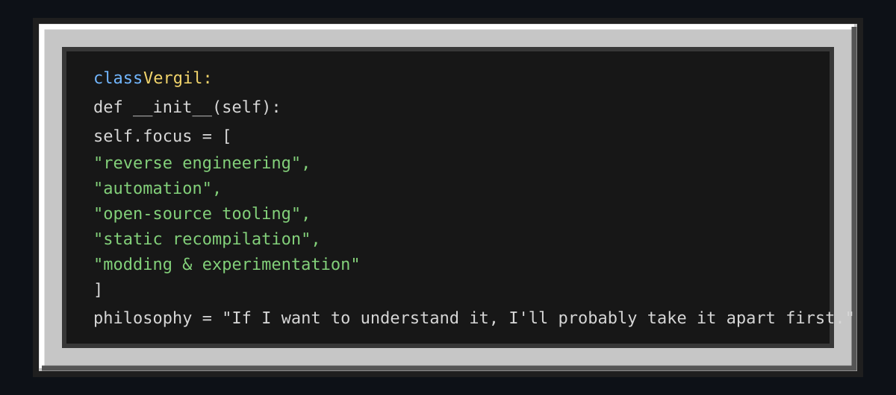
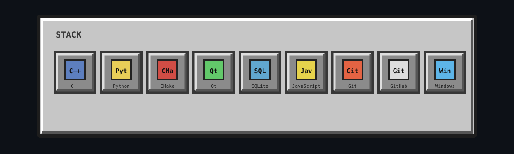
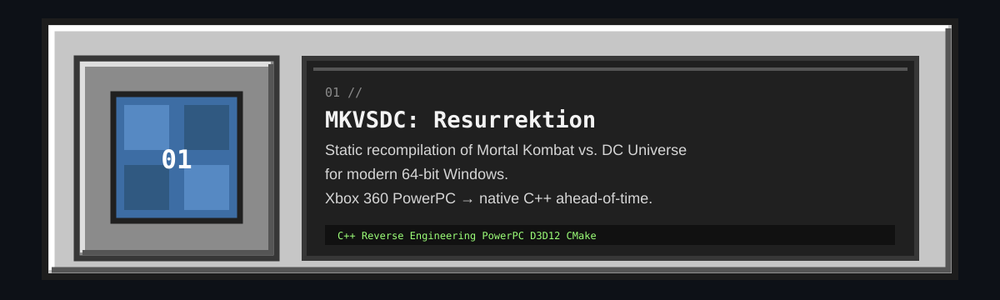
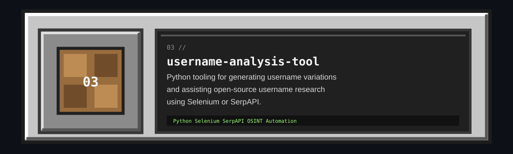
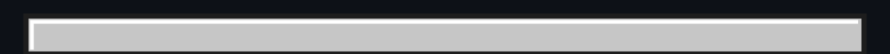
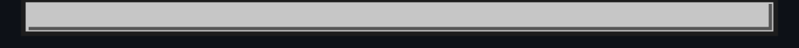

 

 

 

## `> whoami`

 

## `> stack`

 

## `> featured_projects`

 

 

 

## `> system_stats`

 

## `> contributions.exe`

<picture>
  <source
    media="(prefers-color-scheme: dark)"
    srcset="https://raw.githubusercontent.com/VergilMorvx/VergilMorvx/output/github-contribution-grid-snake-dark.svg"
  />
  <source
    media="(prefers-color-scheme: light)"
    srcset="https://raw.githubusercontent.com/VergilMorvx/VergilMorvx/output/github-contribution-grid-snake.svg"
  />
  
</picture>

 

Most things here started because I wanted to see whether I could build them.

  

